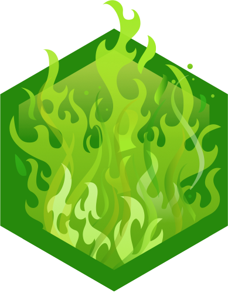

  

###

<h1 align="left">I,m Falaq Iqbal</h1>

###

-A Computer Science student with coursework in Mathematics and Statistics, interested in Artificial Intelligence, Machine Learning and Cybersecurity. I enjoy exploring both theoritical foundations and practical applications of computing.

###

-💡Fun fact: I'm surprisingly good at finding bugs, especially when the code isn't mine

###

<h3 align="left">🛡️My TryHackMe Badges</h3>

  
  

###

<h3 align="left">🛠 Language and tools:</h3>

###

  
  
  
  
  
  
  
  
  
  
  
  
  
  
  
  
  

###

<h3 align="left">🌐Socials:</h3>

###

  
  
  

###

 

  

###

 

<picture>
  <source media="(prefers-color-scheme: dark)" srcset="https://raw.githubusercontent.com/abozanona/abozanona/output/pacman-contribution-graph-dark.svg">
  <source media="(prefers-color-scheme: light)" srcset="https://raw.githubusercontent.com/abozanona/abozanona/output/pacman-contribution-graph.svg">
  
</picture>

  

###
